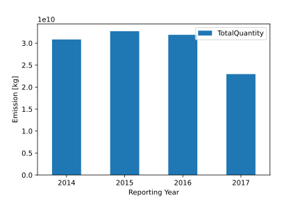
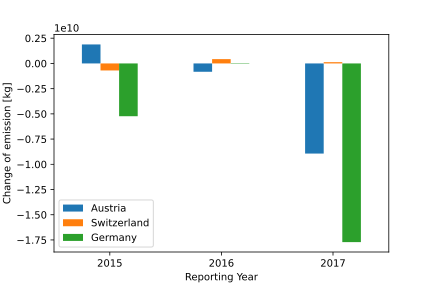
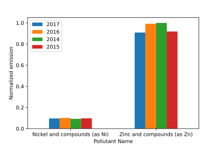
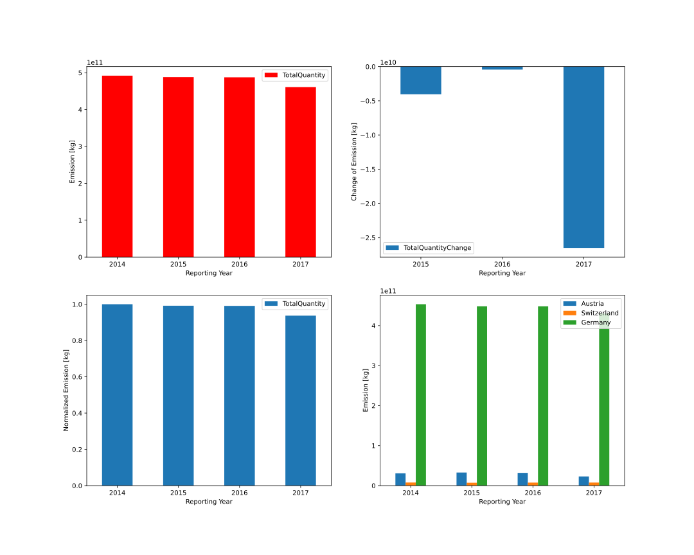

Visualize data sets
===================

| Let's start with generating a filtered data set:

.. code-block:: python

    import emipy as ep

    db = ep.read_db()

    CountryName = ['Germany', 'Austria', 'Switzerland']
    ReportingYear = [2014, 2015, 2016, 2017]
    PollutantName = ['Carbon dioxide (CO2)']

    data1 = ep.f_db(db, CountryName=CountryName, ReportingYear=ReportingYear, PollutantName=PollutantName)

| Now we can plot the CO2 volume against the reporting years:

.. code-block:: python

    ep.plot_PollutantVolume(data1, FirstOrder='ReportingYear')

.. image:: ./pictures/Tut2pic1.svg
    :width: 80%
    :align: center
    :alt: Tut2pic1isit?

| As you can see, the first order is equivalent to the x-axis of the plot and the first parameter that the data is sorted by.
| We can now take a deeper look into our data and sort it additionally by another order:

.. code-block:: python

    ep.plot_PollutantVolume(data1, FirstOrder='ReportingYear', SecondOrder='CountryName')

| Keep in mind, that the plot functions do not filter the data. If you would like to plot e.g. just the output from Austria you would have to create a new data set, and specifiy this as input in a new plot:

.. code-block:: python

    data2 = ep.f_db(data1, CountryName='Austria')
    ep.plot_PollutantVolume(data2, FirstOrder='ReportingYear')

| Additionaly to the pollutant emmisions, you can analyse the change of the emmission over time. As this calculation needs information of the year before, the function can only provide this result for all but the first year in the data table.

.. code-block:: python

    ep.plot_PollutantVolumeChange(data1, FirstOrder='ReportingYear', SecondOrder='CountryName')

| As a third option, you can plot normalised values. With the parameter norm, you can specify the First Order value, that the data is normed to. For a good example we create a new data table:

.. code-block:: python

    CountryName = ['Germany', 'Austria', 'Switzerland']
    ReportingYear = [2014, 2015, 2016, 2017]
    PollutantName=['Zinc and compounds (as Zn)', 'Nickel and compounds (as Ni)']

    data3 = ep.f_db(db,CountryName=CountryName, ReportingYear=ReportingYear, PollutantName=PollutantName)

    ep.plot_PollutantVolumeRel(data3, FirstOrder='PollutantName', SecondOrder='ReportingYear')

| If you want to customize the layout of the graphs, you can enter the known arguments of the `PyPlot package <https://matplotlib.org/3.1.1/tutorials/index.html>`_ into the functions. Since the functions return a matplotlib.axes object, you can access and modify the individual elements of the plots like in PyPlot.
| The code below returns you the basic plots. For the layout changes, take a look into the Tutorial 2 notebook.

.. code-block:: python

    import matplotlib.pyplot as plt

    fig1, fig1_axes = plt.subplots(2, 2)
    fig1_axes[0,0] = ep.plot_PollutantVolume(data1, FirstOrder='ReportingYear', ax=fig1_axes[0,0])
    fig1_axes[1,0] = ep.plot_PollutantVolumeRel(data1, FirstOrder='ReportingYear', ax=fig1_axes[1,0])
    fig1_axes[0,1] = ep.plot_PollutantVolumeChange(data1, FirstOrder='ReportingYear', ax=fig1_axes[0,1])
    fig1_axes[1,1] = ep.plot_PollutantVolume(data1, FirstOrder='ReportingYear', ax=fig1_axes[1,1], color='r')

    plt.show()

