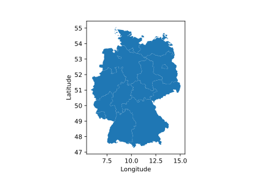
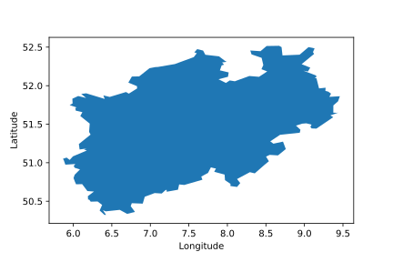
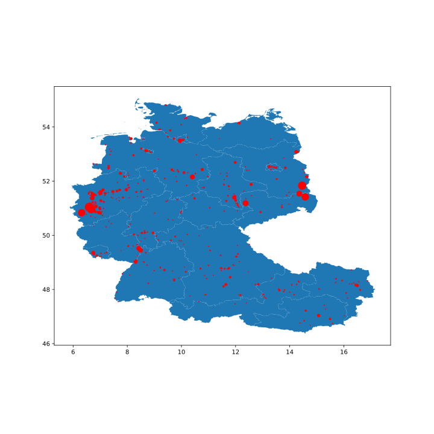
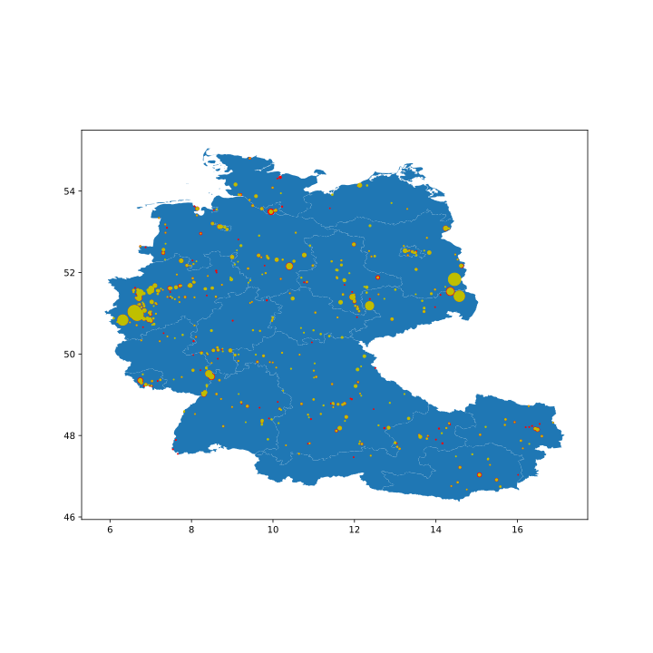
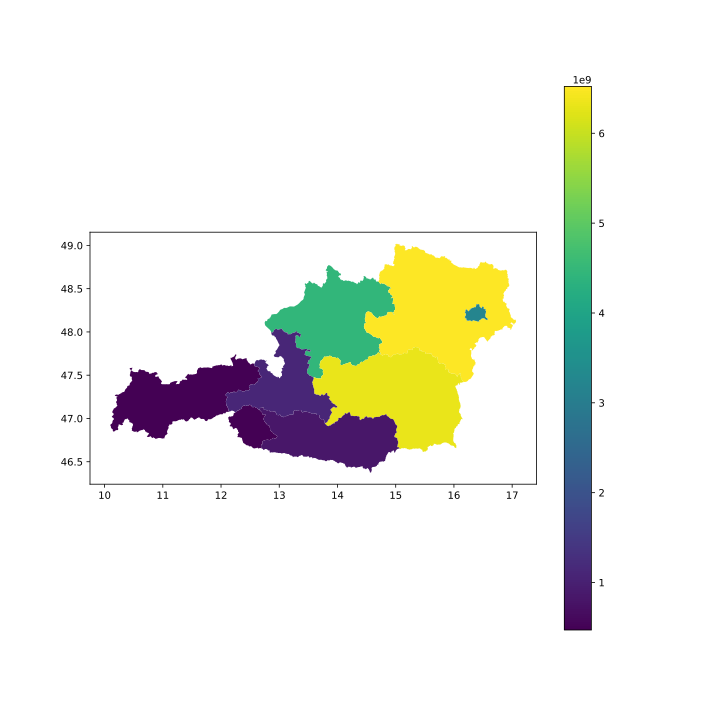

Using map data
==============

| The first thing that you will realise is, that there is not just one data set for the map like in the pollution data. There are different parameters that change the layout of the maps, therefore when reading the map data you can choose from these parameters. Nevertheless, there is a presetting, that gives you a map by the hand.  

.. code-block:: python

    import emipy as ep
    mb = ep.read_mb()

    mb.plot()

| Of special interest is the parameter *NUTS_LVL*, which is the level of the NUTS-ID's which are the codes for categorized regions. See the `Eurostat <https://ec.europa.eu/eurostat/de/web/nuts/nuts-maps>`_ page for more information.  
| We start with the following set up:

.. code-block:: python

    NUTS_LVL = '1'
    resolution = '10M'
    projection = '4326'
    SpatialType = 'RG'
    m_year = '2013'

    mb = ep.read_mb(resolution=resolution, SpatialType=SpatialType, NUTS_LVL=NUTS_LVL, m_year=m_year, projection=projection)
    mb.plot().set(xlabel='Longitude', ylabel='Latitude')

.. image:: ./pictures/Tut3pic1.svg
    :width: 80%
    :align: center
    :alt: Tut3pic1

| The filtering happens with the function f_mb(). Depending on the NUTS level, you can filter for countries or the corresponding NUTS-ID. Additionally, there is the argument *ExclaveExclude* which you can put on True to exclude the exclaves and map continental europe.  

.. code-block:: python

    mapdata1 = ep.f_mb(mb, ExclaveExclude=True)
    mapdata1.plot().set(xlabel='Longitude', ylabel='Latitude')

.. image:: ./pictures/Tut3pic2.svg
    :width: 80%
    :align: center
    :alt: Tut3pic2

| Lets generate a map of Germany

.. code-block:: python

    mapdata2 = ep.f_mb(mb, CNTR_CODE='DE')
    mapdata2.plot().set(xlabel='Longitude', ylabel='Latitude')

| To map e.g. North Rhine-Westphalia you have to know, that the NUTS-ID is 'DEA' and can use it as a filter. You can look up the NUTS_ID' at the link above or take a look in the DataFrame mb.

.. code-block:: python

    mapdata3 = ep.f_mb(mb, NUTS_ID=['DEA'], CNTR_CODE='DE')
    mapdata3.plot(aspect='equal').set(xlabel='Longitude', ylabel='Latitude')

| To combine map data and pollution data you have two options. You can plot the pollution sources on the map or create a colormap of the pollution in the regions.
| Let's start with mapping the CO2 sources in Germany and Austria in the year 2017.

.. code-block:: python

    import matplotlib.pyplot as plt

    db = ep.read_db()

    CountryName = ['Germany', 'Austria']
    ReportingYear = [2017]
    PollutantName = ['Carbon dioxide (CO2)']

    data4 = ep.f_db(db,CountryName=CountryName, ReportingYear=ReportingYear, PollutantName=PollutantName)
    mapdata4 = ep.f_mb(mb, CNTR_CODE=['DE','AT'])

    fig1 = plt.figure()
    ax1 = fig1.add_subplot(1, 1, 1)
    #ax1 = mapdata1.plot(ax=ax1, color='lightgrey')
    ax1 = ep.map_PollutantSource(data4, mapdata4, MarkerSize=200,
                                 ax=ax1).set(xlabel='Longitude', ylabel='Latitude')
    fig1.set_figheight(10)
    fig1.set_figwidth(10)

| If you uncomment everything, you'll get a complete map of Europe in light grey without emission sources, while Germany and Austria are highlighted and show their sources.
| For the `map_PollutantSource()` you have to insert the data and map set. You can choose the MarkerSize, which is the size of the maximal output. The other sources are normalized to this value. If MarkerSize is put on zero or is not given at all, all marker have the same size.  
| 
| `map_PollutantSource()` can return three different objects. The return is specified by the argument *ReturnMarker* which is [0] by default. If not choosen differently the function returns the axes-object, or the plot. ReturnMarker=1 returns the DataFrame with all data that are plotted. ReturnMarker=2 returns the DataFrame with all data that is not plotted. This might happen, when the coordinates of the data is bad and not inside the regions or not given at all.  
| You can also plot different pollutants and color them differently with the parameter *category*.

.. code-block:: python

    CountryName = ['Germany', 'Austria']
    ReportingYear = [2017]
    PollutantName = ['Carbon dioxide (CO2)', 'Nitrogen oxides (NOx/NO2)']

    data5 = ep.f_db(db,CountryName=CountryName, ReportingYear=ReportingYear, PollutantName=PollutantName)
    mapdata5 = ep.f_mb(mb, CNTR_CODE=['DE','AT'])

    fig2 = plt.figure()
    ax1 = fig2.add_subplot(1, 1, 1)
    ax1 = ep.map_PollutantSource(data5, mapdata5, MarkerSize=200, category='PollutantName',
                                 ax=ax1).set(xlabel='Longitude', ylabel='Latitude')
    fig2.set_figheight(10)
    fig2.set_figwidth(10)

| To plot the emission of specific regions you can use the `map_PollutantRegions()` function. In the following example we plot the emission of CO2 in Austria on NUTS-level 2.

.. code-block:: python

    NUTS_LVL = '2'
    Resolution = '10M'
    projection = '4326'
    SpatialType = 'RG'
    m_year = '2013'

    mb = ep.read_mb(resolution=resolution, SpatialType=SpatialType,
                    NUTS_LVL=NUTS_LVL, m_year=m_year, projection=projection)

    CountryName = ['Austria']
    ReportingYear = [2017]
    PollutantName = ['Carbon dioxide (CO2)']

    data6 = ep.f_db(db,CountryName=CountryName, ReportingYear=ReportingYear, PollutantName=PollutantName)
    mapdata6 = ep.f_mb(mb, CNTR_CODE='AT')

    fig3 = plt.figure()
    ax1 = fig3.add_subplot(1, 1, 1)
    ax1 = ep.map_PollutantRegions(data6, mapdata6, ax=ax1, legend=True)
    plt.title("CO2 emission in Austria in the year 2017 in [kg]", fontsize=20)
    fig3.set_figheight(10)
    fig3.set_figwidth(20)
    plt.xlabel('Longitude', fontsize=16)
    plt.ylabel('Latitude', fontsize=16)

| Since the returns of the functions are Axes-objects, you can use PyPlot functions and arguments to change the layout. You can also use `Geopandas <https://geopandas.org/>`_ to personalize the plot generation because the map data is stored as a GeoDataFrame.
