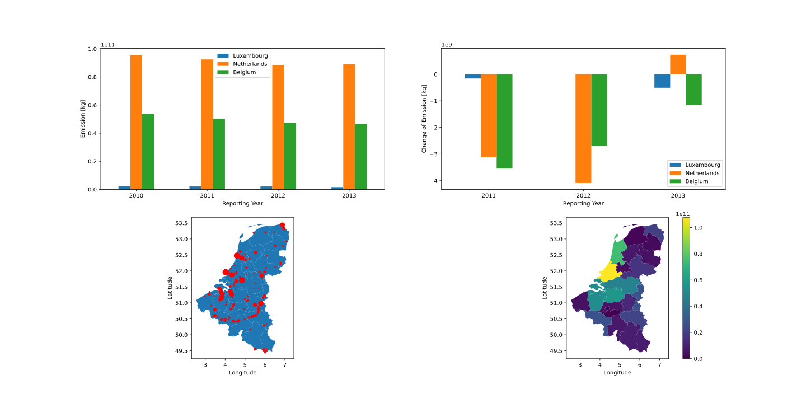

Export Data and Figures
-----------------------

| You can export data tables and figures directly to the ExportData-folder of your project. Aditionally you can depleat unnecessary information and Configurate your data table before export.
|
| Let's start with creating the data of the Benelux states for the pollution of C02 and CH4 (Methane) in the time period 2010-2013.

.. code-block:: python

    import emipy as ep

    db = ep.read_db()

    Countrylist = ['Luxembourg', 'Belgium', 'Netherlands']
    ReportingYear = [2010, 2011, 2012, 2013]
    PollutantName = ['Carbon dioxide (CO2)', 'Methane (CH4)']

    dataset1 = ep.f_db(db, CountryName=Countrylist, ReportingYear=ReportingYear, PollutantName=PollutantName)

| We can now export this data table with:

.. code-block:: python

   ep.export_db_tocsv(dataset1, filename='Benelux.csv')

| emipy searches for the ExportData folder in the path given during the initiation process and stores the file with the described filename over there.
| If you want to export the file to a different path, you can use the argument path to name the corresponding path. 

.. code-block:: python
    ep.export_db_tocsv(dataset1, path=r'C:User\User1\testpath', filename='Benelux2.csv')
    ep.export_db_tocsv(dataset1, path=r'C:User\User1\testpath\Benelux3.csv')

| You can aswell export to other file types. The emipy export functions are based on the `pandas <https://pandas.pydata.org/docs/index.html>`_ export functions and imply their features:

.. code-block:: python

    ep.export_db_topickle(dataset1, filename='Benelux.pkl', compression='zip')
    ep.export_db_toexcel(dataset1, filename='Benelux.xlsx')

.. note::
    | Pandas needs an additional Package for the export to a xlsx file. In consequence we do too. Execute `>pip install openpyxl` in the Anaconda Prompt console.

| Let's create a figure and use map data to visualize our data:

.. code-block:: python

    NUTS_LVL = '2'
    Resolution = '10M'
    projection = '4326'
    spatialtype = 'RG'
    m_year = '2013'

    mb = ep.read_mb(Resolution=Resolution, spatialtype=spatialtype, NUTS_LVL=NUTS_LVL, m_year=m_year, projection=projection)

    mapdata1 = ep.f_mb(mb, CNTR_CODE=['BE', 'LU', 'NL'])

    import matplotlib.pyplot as plt

    fig1, ax = plt.subplots(2, 2, figsize=(8.27, (1.5/3)*11.69))
    ep.plot_PollutantVolume(dataset1, ax=ax[0,0], FirstOrder='ReportingYear', SecondOrder='CountryName')
    ep.plot_PollutantVolumeChange(dataset1, ax=ax[0,1], FirstOrder='ReportingYear', SecondOrder='CountryName')
    ep.map_PollutantSource(dataset1,mapdata1, ax=ax[1,0], markersize=100)
    ep.map_PollutantRegions(dataset1, mapdata1, ax=ax[1,1], legend=True)

| The export of the figures is based on `matplotlib.pyplot.savefig <https://matplotlib.org/3.1.1/api/_as_gen/matplotlib.pyplot.savefig.html>`_ and has the same features for the export, but automatically saves the figure to the ExportFolder, if not stated otherwise.

.. code-block:: python

    ep.export_fig(fig1, filename='Benelux.png')
    ep.export_fig(fig1, filename='Benelux.pdf', facecolor='w', edgecolor='w')
    ep.export_fig(fig1, filename='Benelux.svg', quality=60, facecolor='w', edgecolor='w')    

| Emipy provides functions for the export to calliope. Calliope is a multi-scale energy systems modelling framework.

