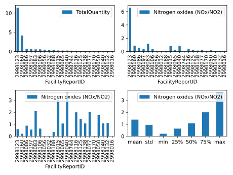

.. _tut5:

Special Features
================

| There are several functions that enhance the usage of emipy. In this tutorial we take a look at these functions and work threw their use cases.

Change root path
----------------

| At first let's take a look at the configuration options of emipy. When initialise an emipy project, we defined a path to the root of the project. This path is stored in a config file and is used when the data is loaded in a session or auto exported to the export folder.
| When you use emipy in another environment than the one in which you initialised emipy, your root path is not set to the projects folder. If you want to continue your work in this project, or simply don't want to download all data again, you can adapt this path.

.. code-block:: python

    import emipy as ep

    ep.change_RootPath(r'Your\individual\path\to\your\project')

Downloading additional map data
-------------------------------

| During the initialization, emipy downloads `map data <https://ec.europa.eu/eurostat/de/web/gisco/geodata/reference-data/administrative-units-statistical-units/nuts#nuts21>`_ from Eurostat. There is not just one map, but a lot of different ways to visualize the countries.
| Emipy downloads the predefined set with resolution factor 1:10 Million, but you can download additional map data if wanted. For the download you can choose from the resolution (1:1,3,10,20,60 Million) and emipy downloads the map data for all publication years, projections and NUTS-LVL into the projects MappingData folder. With *read_mb()* you can make further choices of the way, your map is diplayed. For more details see :ref:`datainformation`.
| The *resolution* can be an Integer or a list of Integers which values has to be the resolution factor. You can put the parameter *clear* to True, to clear the MappingData folder before downloading. This prevents doublication of data and reduces the memory size.
	
.. code-block:: python

	example_res =[3,60]
	ep.download_MapData(r'The\path\to\the\root\of\your\project', resolution=example_res, clear=True)

Change Units
------------

| When working with the pollution data, you might want to change the unit of the emission. The function *change_unit()* reads the current unit for all entries and recalculates the emission value to the new unit and stores the new unit code in the DataFrame.

.. code-block:: python

    db = ep.read_db()
    data1 = ep.f_db(db,CountryName='Germany')
    data2 = ep.change_unit(data1, unit='megaton')

Data Table Adaption
-------------------

| For the export you might not need all of the 73 columns and want to increase your overview. You can exclude columns and reduce the columns to those which you are interested in.
| The function *row_reduction()* uses information from the config file to determine which columns are defined as columns of interest. You can change these configuration with *change_ColumnsOfInterest()*. You can use the paramter *total* to change the complete list, *add* to add column names or *sub* to substract from present column names. If you put the parameter *reset* on True, you reset the list of column names to the initial state.

.. code-block:: python

    data3 = ep.row_reduction(data1)
    total=['CountryCode', 'CountryName']
    ep.change_ColumnsOfInterest(total=total, add=None, sub=None, reset=False)
    data4 = ep.row_reduction(data3)
    ep.change_ColumnsOfInterest(total=None, add='Lat', sub=None, reset=False)
    data5 = ep.row_reduction(data3)
    ep.change_ColumnsOfInterest(total=None, add=None, sub='CountryCode', reset=False)
    data6 = ep.row_reduction(data3)
    ep.change_ColumnsOfInterest(total=None, add=None, sub=None, reset=True)
    data7 = ep.row_reduction(data3)

| There is also an option to rename the columns at large scale. The working principle is the same as the column reduction but you have to insert dicts instead of strings or lists.

.. code-block :: python

	addition={'Lat': 'Latitude'}
	ep.change_RenameDict(total=None, add=addition, sub=None, reset=False)
	data8 = ep.rename_columns(data3)

	ep.change_RenameDict(total=None, add=None, sub=None, reset=True)
	data9 = ep.rename_columns(data3)

Emission information
--------------------

| So far you have produced filtered data bases and plots of these data bases. But perhaps you want to get the information of your plot in form of a data table. 

.. code-block :: python

	data10 = ep.get_PollutantVolume(data2, FirstOrder='ReportingYear')
	data11 = ep.get_PollutantVolumeRel(data2, FirstOrder='ReportingYear')
	data12 = ep.get_PollutantVolumeChange(data2, FirstOrder='ReportingYear')

| In comparison to your data base, this table has summed up all emissions for your order parameter. The usage of the order parameter is the same as in the plot functions.

NACE-Code selection
-------------------

| The economical classification of the entries with the NACE-Code is not consistent over time. The European Union performed a revision of the NACE-Classification NACE 1.1 to NACE 2. In consequence, the entries for the years 2001 and 2004 are encoded in the old classification, while the newer entries are encoded by NACE 2.
| Emipy provides a function that performes an transition of the old codes to the new, based on the `transition tables <https://ec.europa.eu/eurostat/de/web/nace-rev2/correspondence_tables>`_, provided by Eurostat.

.. code-block :: python

    db2 = ep.read_db()
    db = ep.perform_NACETransition(db2)

| The transition does not allow an unique assignment of new codes, which is why the new codes may be stored as list of multiple codes. In a consequence, entries might pass your filter, but are not truly part of your requested data. You might want to check for these entries, if they really are part of your economic field.
| There exist entries in the old data, that have 2 different NACE 1.1 Code, which have no assignment in the `transition tables <https://ec.europa.eu/eurostat/de/web/nace-rev2/correspondence_tables>`_. For these cases we decided for a assignment. 
| The NACECode 27.35 is translated to 24.10 since the NACEMainEconomicActivityName of both sounds very similar. 74.84 is translated to 59.20, 63.99, 74.10, 74.90, 77.40, 82.30, 82.91, 82.99. Here the NACEMainEconomicActivityName is the same as for 74.87 and we copied the transition from this NACECode.
| You can finde the NACE-Codes in the `NACE Rev.2 <https://ec.europa.eu/eurostat/documents/portlet_file_entry/3859598/KS-RA-07-015-EN.PDF.pdf/dd5443f5-b886-40e4-920d-9df03590ff91>`_ starting at page 63. Choosing the right code enables you to filter for your request. *NACEMainEconomicActivityCode* needs a string with the complete NACE Code like '01.46' or a list of these Codes.

.. code-block :: python

	data13 = ep.f_db(db, NACEMainEconomicActivityCode='35.11')

| Some groups of NACE codes are stored in the config file. You can access them with *get_NACECode_filter()*. If the parameter *specify* is None, which it is by default, you receive a list of dictionaries which have the NACE Codes as list corresponding to the key name. You can put *specify* to on of the keys to receive the value, the list of NACE Codes.

.. code-block :: python

	print(ep.get_NACECode_filter())
	NACECode = ep.get_NACECode_filter(specify = 'animal production')
	data14 = ep.f_db(db2, NACEMainEconomicActivityCode=NACECode)

| You can create your own NACE-Code lists with *change_NACECode_filter()*. This works very much like *change_RenameDict()*. You can add and subtract single key/value pairs, or replace the complete dictionary. For the right syntax, make sure your codes are 5 characters long and seperated by a comma.

.. code-block :: python

	ep.change_NACECode_filter(add={'metalmanufaction':'24.51,24.52,24.53,24.54'})
	ep.change_NACECode_filter(sub={'metalmanufaction':'24.51,24.52,24.53,24.54'})

Impurity analysis
-----------------

| The emission of specific pollutants comes with emission of other pollutants. In consequence you do not have pure emissions, but impurities to your target pollutant. To analyse these, emipy provides the functions *get_ImpurityVolume()* and *plot_ImpurityVolume()*.
| You can specify your analysis with a few parameters. At first you specify your data that is to analyse with calling db. Then you name the target pollutant, which is the impured one. For the plot function you also have to specify the impurity molecule that you are looking for.
| Additional paramters for the get_ function are *FirstOrder*, *ReleaseMediumName*, *absolute*, *FacilityFocus*, *impurity* and *statistics*. With *FirstOrder*, you specify the column at which your data is sorted. The default is FacilityReportID, since it is very intuitive to look for the impurities of specific facilities. Nontheless, you could also choose for example NUTSRegionGeoCode, to make a region analysis, rather than a facility analysis.

.. code-block :: python

    data = ep.f_db(db, CountryName='Germany')
    data16 = ep.get_ImpurityVolume(db=data, target='Carbon dioxide (CO2)', FirstOrder='NUTSRegionGeoCode')
    ep.plot_ImpurityVolume(db=data, target='Carbon dioxide (CO2)', impurity='Carbon monoxide (CO)', FirstOrder='NUTSRegionGeoCode')

| You can change the *ReleaseMediumName* to Water or Soil, if your target pollutant is emitted in another medium than air. The function returns the emission value of your impurity in relation to the emission of your target. If you want to get the absolute value, you can change the *absolute* parameter to True.

.. code-block :: python

	data17 = ep.get_ImpurityVolume(db=data, target='Carbon dioxide (CO2)', ReleaseMediumName='Air', absolute=True)

| If your *FirstOrder* is something else than FacilityReportID, the *FacilityFocus* parameter becomes interesting. If this parameter is True, only impurities emitted in facilities that aswell emit your target pollutant are considered. You can put the parameter to False, to turn this feature off and analyse the impurities of all facilities in your Order parameter.

.. code-block :: python

	data18 = ep.get_ImpurityVolume(db=data, target='Carbon dioxide (CO2)', FirstOrder='NUTSRegionGeoCode', FacilityFocus=False)
	ep.plot_ImpurityVolume(db=data, target='Carbon dioxide (CO2)', impurity='Carbon monoxide (CO)', FirstOrder='NUTSRegionGeoCode', FacilityFocus=False)
	
| If you have not specified the impurity, you will get a table with all present impurities. You can specify your impurity, to receive only your impurity of interest.

.. code-block :: python

	data19 = ep.get_ImpurityVolume(db=data, target='Carbon dioxide (CO2)')
	data20 = ep.get_ImpurityVolume(db=data, target='Carbon dioxide (CO2)', impurity='Carbon monoxide (CO)')

| You can also set the parameter *statistics* to False or True to either simply get or plot your impurity values or to get or plot the statistics of these. The default is False.

.. code-block :: python

	ep.get_ImpurityVolume(db=data, target='Carbon dioxide (CO2)', impurity='Carbon monoxide (CO)')
	ep.plot_ImpurityVolume(db=data, target='Carbon dioxide (CO2)', impurity='Carbon monoxide (CO)', statistics=True)

| When creating a data table with *get_ImpurityVolume()* you will often have NaN as entries. This happens because different facilities have different impurities. So a NaN value means, that there is no impurity of this pollutant type listet in the data base. This does not mean, that there is definitly no impurity. Impurities can be below a certain threshold value and therefore not listet in the E-PRTR.
| If *statistics* is True, *plot_ImpurityVolume()* automatically ignores NaN values. When you plot your simple impurity values, you can set the parameter *PlotNA* to False. Then the na values are not plotted.

The following example illustrates emipy's functionality for impurity analysis.

.. code-block :: python

    db = ep.read_db()

    data1 = ep.f_db(db, ReportingYear=2015, CountryName='France', NUTSRegionGeoCode='FR30',
                    PollutantName='Carbon dioxide (CO2)')
    data1 = ep.change_unit(data1, unit='megaton')
    data2 = ep.f_db(db, ReportingYear=2015, CountryName='France', NUTSRegionGeoCode='FR30')

    testdata=ep.get_PollutantVolume(data1, FirstOrder='FacilityReportID').sort_values('TotalQuantity', ascending=False)
    testdata2=ep.get_ImpurityVolume(data2, target='Carbon dioxide (CO2)', impurity='Nitrogen oxides (NOx/NO2)', absolute=True).sort_values('TotalQuantity', ascending=False)
    testdata2.loc[:,'Nitrogen oxides (NOx/NO2)'] /= 1000000

    testdata3=ep.get_ImpurityVolume(data2, target='Carbon dioxide (CO2)', impurity='Nitrogen oxides (NOx/NO2)').sort_values('TotalQuantity', ascending=False)
    testdata3.loc[:,'Nitrogen oxides (NOx/NO2)'] *= 1000
    testdata4=ep.get_ImpurityVolume(data2, target='Carbon dioxide (CO2)', impurity='Nitrogen oxides (NOx/NO2)', statistics=True)
    testdata4.loc[:,'Nitrogen oxides (NOx/NO2)'] *= 1000
    testdata4 = testdata4.drop('count')

    fig3, ax = plt.subplots(2, 2)

    testdata.plot(x='FacilityReportID', y='TotalQuantity', ax=ax[0, 0], kind='bar')
    testdata2.plot(x='FacilityReportID', y='Nitrogen oxides (NOx/NO2)', ax=ax[0,1], kind='bar')
    testdata3.plot(x='FacilityReportID', y='Nitrogen oxides (NOx/NO2)', ax=ax[1,0], kind='bar')
    testdata4.plot(y='Nitrogen oxides (NOx/NO2)', ax=ax[1,1], kind='bar', rot=0)

    plt.tight_layout()
    ep.export_fig(fig3, filename='impurity_analysis.pdf')

Calliope Export
------------------
| The following code generates csv and yaml files for the use with the energy modelling framework Calliope.
| The csv file contains information about the supply constraint of the carbon dioxide source

.. code-block :: python

    db = emipy.read_db()
    source = f_db(db, CountryName='Germany', ReportingYear=2017, PollutantCode='CO2', City='Dueren')
    emipy.export_calliope(source)

| The generated yaml file contains the technology definition. In the default setting the costs for :math:`CO_2` provision are set to 70€ (which can be specified using the *sc* variable).

.. code-block :: yaml

    3519569:
    techs:
        co2_supply:
            essentials:
                name: CO2 Supply
                color: '#0b95ef'
                parent: supply
                carrier: co2
            constraints:
                resource: file=emipy2calliope.csv:3519569
                energy_cap_max: 20776.255707762557
                lifetime: 1
            costs:
                monetary:
                    interest_rate: 0
                    om_prod: 0.07
    coordinates:
        lat: 50.776516546
        lon: 6.48949128038
