Tutorials
=========

Generating data sets
--------------------

| At first import the module processdata and read the data base:

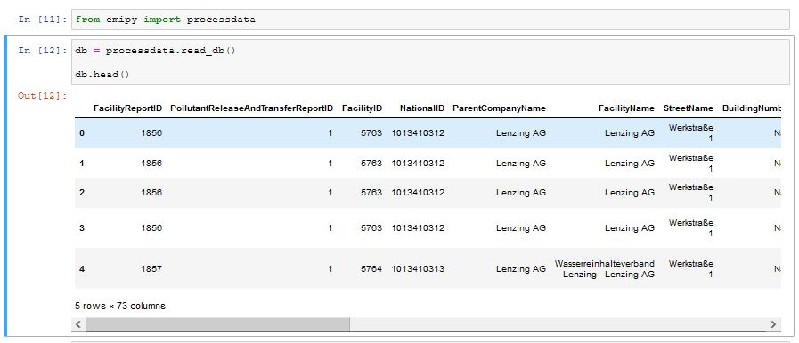

| The programm stored the path to the project initialisation and automatically searches for the data there and loads it. You can aswell read explicit databases. For this, give the function read_db() the path in form of a String as an argument.
| A list of possible columnnames to filter for is displaced with:

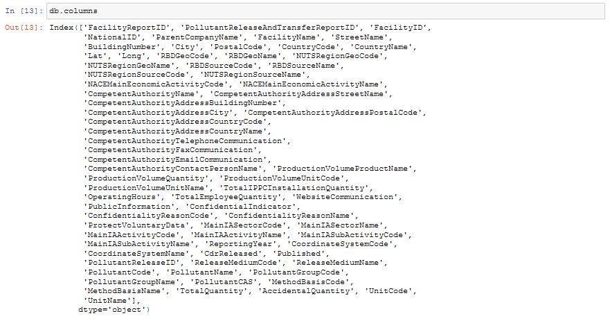

| If you are interested in e.g. the countries that occur in your database you can receive a list with:

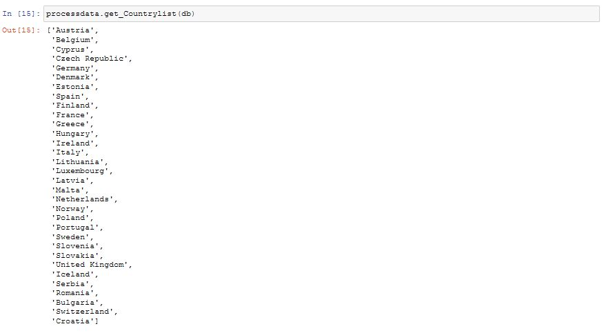

| There are more get_xy() functions to get information about possible filter parameters. See the processdata module description for this.
| The actual filtering happens with the function f_db(). You have to specifiy the database that you want to filter and the columnnames and column values that you want to filter for.
| Let's filter for pollution in Germany:

    ``data1 = processdata.f_db(db, CountryName='Germany')``

| If you want to filter for multiple values in one column you have to insert a list.

    ``data2 = processdata.f_db(db, CountryName=['Germany', 'Switzerland', 'Austria'])``

| You can filter for multiple columns at the same time:

.. code-block:: python

    CountryName = ['Germany', 'Austria', 'Switzerland']
    ReportingYear = [2014, 2015, 2016,2017]
    PollutantName = ['Carbon dioxide (CO2)', 'Methane (CH4)']

    data3 = processdata.f_db(db, CountryName=CountryName, ReportingYear=ReportingYear, PollutantName=PollutantName)

| Take into account that numbers a not from type string and therefore do not need '' around them. For the precise values use the get_xy() function. You can also filter step by step. For this you would have to insert the filtered database into the filter function.
| You can adjust two more arguments in f_db().

    ``data4 = processdata.f_db(db, ExclaveExclude=True)``

| sorts out the exclaves of countries, if you are only interested in the continent Europe and

    ``data5 = processdata.f_db(db, returnna=True)``

| returns a data table, which contains all entries that would be sorted out in the filter process but just do not possess enough information to pass the filter. If this table is empty, then it is a good sign.
| Now you can generate your own data set of interest with a few lines of code. Since db is a DataFrame object, you can use all `pandas <https://pandas.pydata.org/docs/index.html>`_ functions as well, to personalize your data generation.
| As a last step you might want to save your just created data tables. Depending on the storage data type, you can use different functions. These functions have the same arguments as the pandas export functions, but automatically store the data in the export file of your emipy project, if there is no path given.

.. code-block:: python

    processdata.export_db_topickle(data1, filename='Deutschland.pkl')
    processdata.export_db_tocsv(data2, filename='Germanspeakingarea.pkl')
    processdata.export_db_toexcel(data3, filename='CO2andMethan.pkl')

Visualize data sets
-------------------

| Let's start with generating a filtered data set:

.. code-block:: python

    from emipy import processdata
    from emipy import visualizedata

    db = processdata.read_db()

    CountryName = ['Germany', 'Austria', 'Switzerland']
    ReportingYear = [2014, 2015, 2016, 2017]
    PollutantName = ['Carbon dioxide (CO2)']

    data1 = processdata.f_db(db, CountryName=CountryName, ReportingYear=ReportingYear, PollutantName=PollutantName)

| Now we can plot the CO2 volume against the reporting years:

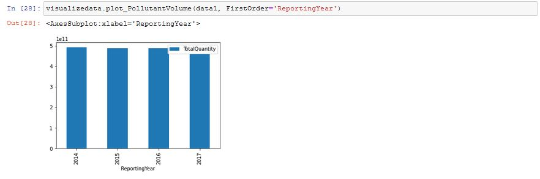

| As you can see, the first order is equivalent to the x-axis of the plot and the first parameter that the data is sorted by.
| We can now take a deeper look into our data and sort it additionally by another order:

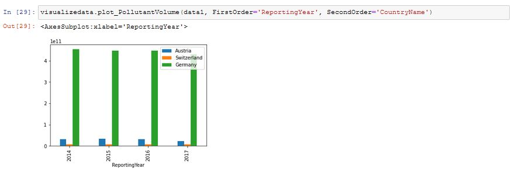

| Keep in mind, that the plot functions do not filter the data. If you would like to plot e.g. just the output from Austria you would have to create a new data set, and specifiy this as input in a new plot:

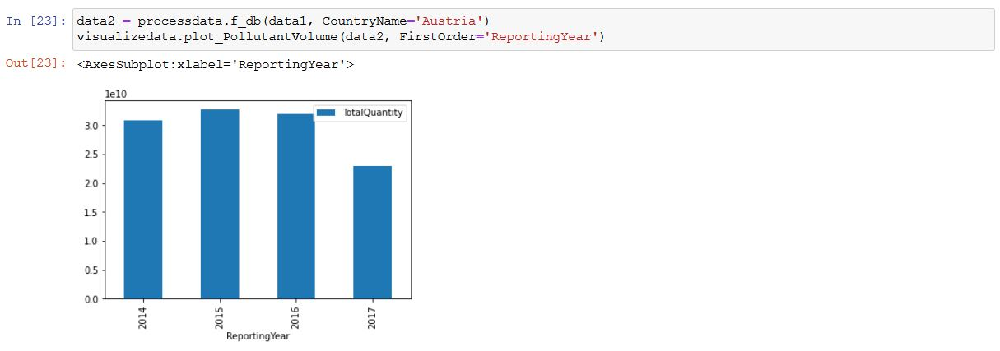

| Additionaly to the pollutant emmisions, you can analyse the change of the emmission over time. As this calculation needs information of the year before, the function can only provide this result for all but the first year in the data table.

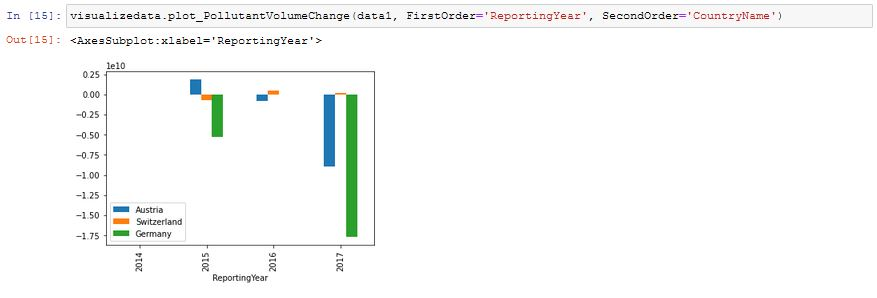

| As a third option, you can plot normalised values. With the parameter norm, you can specify the First Order value, that the data is normed to. For e good example we create a new data table:

.. code-blocks:: python

    CountryName = ['Germany', 'Austria', 'Switzerland']
    ReportingYear = [2014, 2015, 2016, 2017]
    PollutantName=['Zinc and compounds (as Zn)', 'Nickel and compounds (as Ni)']

    data2 = processdata.f_db(db,CountryName=CountryName, ReportingYear=ReportingYear, PollutantName=PollutantName)

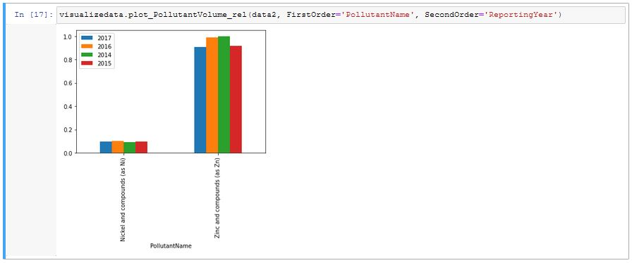

| If you want to customize the layout of the graphs, you can enter the known arguments of the PyPlot package into the functions. For a detailed documentation look `here <https://matplotlib.org/3.1.1/tutorials/index.html>`_. Since the functions return a matplotlib.axes object, you can access and modify the individual elements of the plots like in PyPlot.

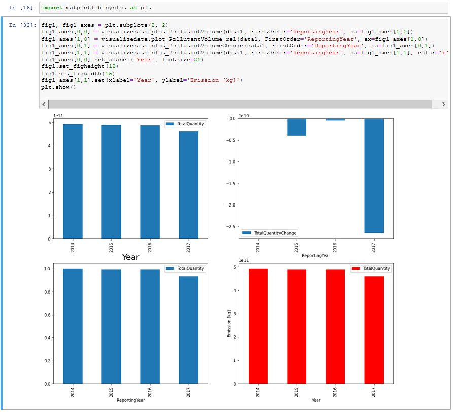

| As a last step you might want to save the plots you have created. This can be done with the savefig() function of PyPlot. Another method is to use the export_fig() function of emipy. This function will automatically save the function to the export folder of your emipy project. All selection arguments of the savefig() function are implemented.

    ``visualizedata.export_fig(fig1, filename='CO2_Daten.png', dpi=80, bbox_inches=#tight')``

Using map data
--------------

| The first thing that you will realise is, that there is not just one data set for the map like in the pollution data. There are different parameters that change the layout of the maps, therefore when reading the map data you can choose from these parameters. Nevertheless, there is a presetting, that gives you a map by the hand.  
| Of special interest is the parameter "NUTS_LVL", which is the level of the NUTS-ID's which are the codes for categorized regions. See `here <https://ec.europa.eu/eurostat/de/web/nuts/nuts-maps>`_ for more information.  
| We start with the following set up:

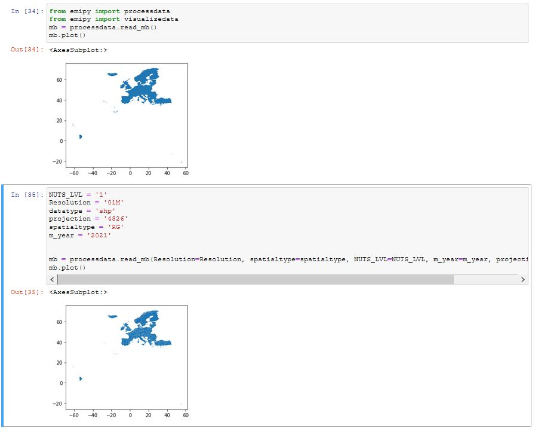

| The filtering happens with the function f_mb(). Depending on the NUTS level, you can filter for countries or the corresponding NUTS-ID. Additionally, there is the argument ExclaveExclude which you can put on true to exclude the exclaves and map continental europe.  
| To map e.g. North Rhine-Westphalia you have to know, that the NUTS-ID is 'DEA' and can use it as a filter. You can look up the NUTS_ID' at the link above or take a look in the DataFrame mb.

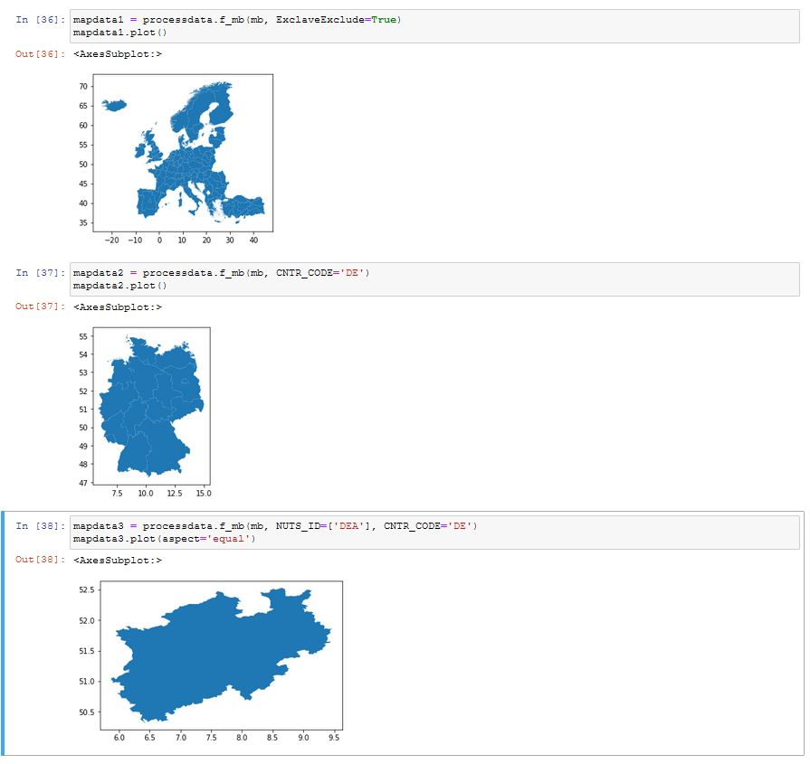

| To combine map data and pollution data you have two options. You can plot the pollution sources on the map or create a colormap of the pollution in the regions.
| Let's start with mapping the CO2 sources in Germany and Austria in the year 2017.

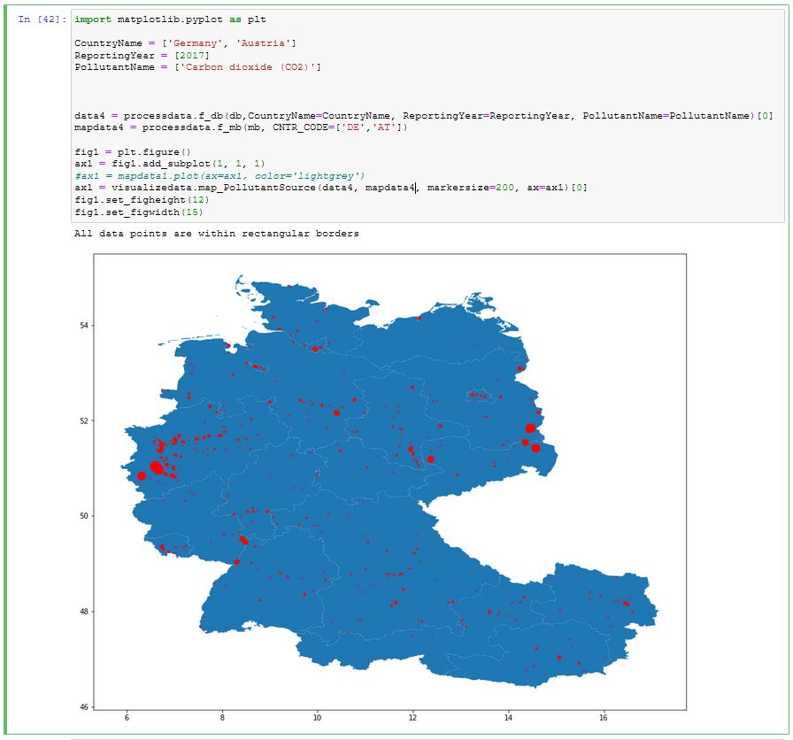

| If you uncomment everything, you'll get a complete map of europe in light grey without emission sources, while Germany and Austria are highlighted and show their sources.
| For the `map_PollutantSource() you have to insert the data and map set. You can choose the markersize, which is the size of the maximal output. The other sources are normalized to this value. If markersize is put on zero or is not given at all, all marker have the same size.  
| map_PollutantSource returns three objects, therefore you have to specifiy which one you want to return. [0] returns the axes-object, or the plot. [1] returns the DataFrame with all data that are plotted. [2] returns the DataFrame with all data that is not plotted. This might happen, when the coordinates of the data is bad and not inside the regions or not given at all.  
| You can also plot different pollutants and color them differently with the parameter 'category'.

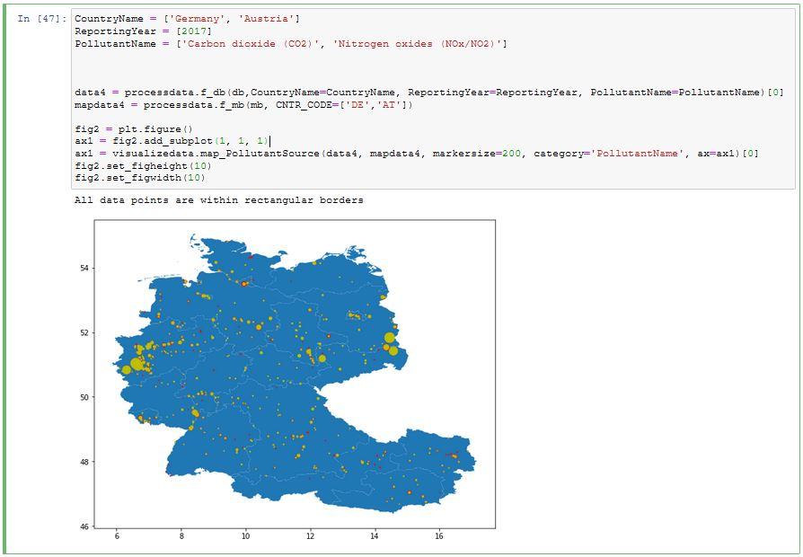

| To plot the emission of specific regions you can use the `map_PollutantRegions()` function. In the following example we plot the emission of CO2 in Austria on NUTS-level 2.

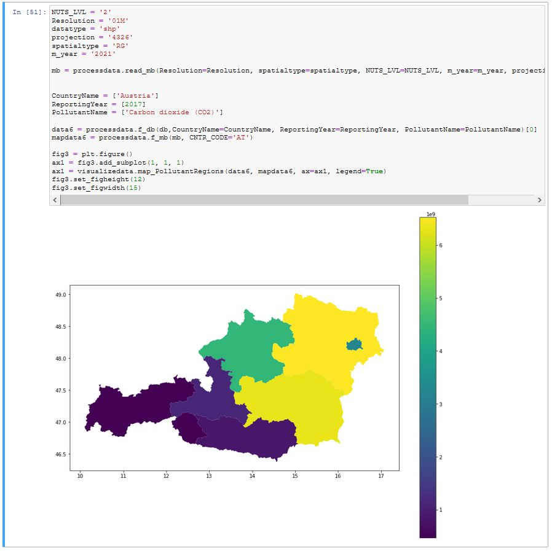

| Since the returns of the functions are Axes-objects, you can use PyPlot functions and arguments to change the layout. You can also use `Geopandas <https://geopandas.org/>`_ to personalize the plot generation because the map data is stored as a GeoDataFrame.